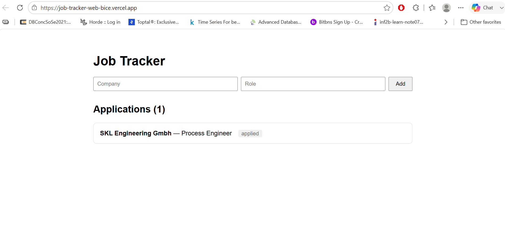

Here is a complete, professional, and well-structured `README.md` file specifically for your **frontend** (`web`) folder. 

It includes the tech stack, setup instructions, environment variables, and deployment details. 

Copy the entire block below and paste it into your `web/README.md` file on GitHub.

```markdown
# Job Tracker - Frontend

A modern, responsive web application for tracking job applications. Built with React, Vite, and TypeScript, this frontend connects to a Node.js/Express backend to provide a seamless user experience for managing your job search.

## 🚀 Live Demo
- **Frontend Application:** [https://your-vercel-link.vercel.app](https://your-vercel-link.vercel.app)
- **Backend API:** [https://your-render-link.onrender.com/health](https://your-render-link.onrender.com/health)

*(Replace the links above with your actual deployed URLs)*

## 📸 Screenshots

*(Replace this with a screenshot of your app. Drag and drop an image into GitHub to generate a link, or add a `screenshot.png` to your repo).*

## 🛠️ Tech Stack
- **Framework:** [React](https://reactjs.org/)
- **Build Tool:** [Vite](https://vitejs.dev/)
- **Language:** [TypeScript](https://www.typescriptlang.org/)
- **HTTP Client:** Fetch API
- **Deployment:** [Vercel](https://vercel.com/)

## ✨ Features
- **View Applications:** Displays a clean list of all job applications fetched from the backend.
- **Add Applications:** A simple form to add a new company and role to the tracker.
- **Real-time Updates:** The UI automatically refreshes to show the latest data after adding a new application.
- **Type Safety:** Fully typed with TypeScript for a robust development experience.

## 💻 Local Setup

### Prerequisites
Make sure you have [Node.js](https://nodejs.org/) installed (v18 or higher recommended).

### 1. Clone the repository
```bash
git clone https://github.com/rkumar49/job-tracker-web.git
cd job-tracker-web
```

### 2. Install dependencies
```bash
npm install
```

### 3. Set up environment variables
Create a `.env` file in the root of the `web` folder and add the following:

```env
# Point this to your local backend API
VITE_API_URL="http://localhost:4000/api/applications"
```
*(Note: If you don't create this file, the app will default to `http://localhost:4000/api/applications`.)*

### 4. Start the development server
```bash
npm run dev
```
Open [http://localhost:5173](http://localhost:5173) in your browser to see the app.

## 📦 Available Scripts
- `npm run dev` - Starts the Vite development server with Hot Module Replacement (HMR).
- `npm run build` - Compiles the TypeScript code and builds the app for production.
- `npm run preview` - Locally previews the production build.
- `npm run lint` - Runs ESLint to check for code quality issues.

## 🌐 Deployment (Vercel)
This frontend is deployed on [Vercel](https://vercel.com/). 

To deploy your own:
1. Push your code to a GitHub repository.
2. Go to Vercel and click **Add New Project**.
3. Import your repository and select **Vite** as the framework preset.
4. In the **Environment Variables** section, add:
   - **Key:** `VITE_API_URL`
   - **Value:** `https://your-render-backend-url.onrender.com/api/applications`
5. Click **Deploy**.

## 📁 Project Structure
```text
web/
├── src/
│   ├── App.tsx          # Main application component and logic
│   ├── main.tsx         # React entry point
│   └── vite-env.d.ts    # Vite TypeScript definitions
├── index.html           # HTML entry point
├── package.json         # Project dependencies and scripts
├── tsconfig.json        # TypeScript configuration
└── vite.config.ts       # Vite configuration
```

## 🤝 Contributing
This is a personal portfolio project, but suggestions and feedback are always welcome! Feel free to open an issue or submit a pull request.

## 📄 License
This project is open source and available under the [MIT License](LICENSE).
```


